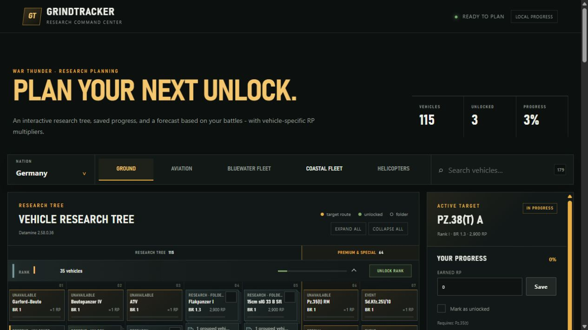

# GrindTracker

A War Thunder research planner built with React and TypeScript. GrindTracker connects an interactive vehicle tree
with progress tracking and an RP calculator, helping players estimate the battles and time needed for their next unlock.

**[Open the live app](https://itsmeraijin.github.io/GrindTracker-WarThunder_RP_Calculator/)**

## Features

- **Interactive research trees** - browse nations and vehicle branches, search by name, expand vehicle folders,
  and follow the prerequisite route to a selected target. Research vehicles and premium or special vehicles are
  displayed in separate columns.
- **Progress tracking** - save earned RP, mark individual vehicles as unlocked, or update an entire rank.
  Vehicle cards, rank progress bars, and completion statistics reflect those changes.
- **Research forecasts** - enter results from up to five recent battles or use an average RP gain and battle duration.
  Calculate remaining RP, estimated battles, research time, and an approximate GE conversion.
- **Vehicle-specific calculations** - select the vehicle used in battle and an Arcade, Realistic, or Simulator mode.
  Forecasts account for RP multipliers, rank efficiency, and the direct predecessor bonus.
- **Prerequisite planning** - estimate a single target or its required research route, with a breakdown for each
  vehicle and saved progress deducted from the remaining RP.

## Using the planner

1. Choose a nation and a branch, then select a target in the research tree.
2. Enter existing research progress and choose the vehicle used to earn RP.
3. Add **Modification RP** and battle duration from recent results, or enter your averages.
4. Calculate the plan. Enable prerequisite vehicles to include the research needed before reaching the target.

Observed Modification RP already includes vehicle and economy bonuses. For values before those bonuses, **Input is
base RP** enables premium account, talisman, booster, and skill modifiers. Research efficiency is calculated for each
target on the route.

## Implementation

| Layer    | Technologies and responsibilities                                                                                                     |
|----------|---------------------------------------------------------------------------------------------------------------------------------------|
| Frontend | React, TypeScript, Vite, and custom CSS; tree layout, filters, planner controls, and progress states                                  |
| Backend  | Python, FastAPI, Pydantic, SQLAlchemy, SQLite, and Alembic; catalog import, forecasts, accounts, and progress synchronization         |
| Data     | Versioned catalog imported from the community War Thunder datamine, including costs, multipliers, folders, and research prerequisites |
| Quality  | Vitest, pytest, Ruff, strict TypeScript checks, dependency audits, and builds in GitHub Actions                                       |

The **live app** runs on GitHub Pages. It loads a bundled vehicle catalog, calculates forecasts in the browser, and
stores progress in local storage. No account is required; saved progress belongs to the current browser and device.

The **API version** uses FastAPI for data and calculations and supports account-based progress synchronization.
Both versions share the same interface. A set of forecast scenarios generated by the Python calculator verifies
that the TypeScript implementation returns matching results. Stable vehicle identifiers preserve local progress
when the bundled catalog is refreshed.

## Development

See the [development guide](docs/DEVELOPMENT.md) for local setup, tests, catalog updates, and deployment.

## Data and calculation limits

- Catalog data comes from [War Thunder Datamine](https://github.com/gszabi99/War-Thunder-Datamine). Each bundled
  snapshot includes its version and source revision; it may lag behind live game updates.
- Forecasts estimate future progress from the supplied battle results. Modification-tier bonuses, daily research
  bonuses, and contributions from mixed vehicle line-ups are not currently modeled.
- GE conversion uses the approximate rate of **1 GE ≈ 45 RP**.
- Progress is entered manually; GrindTracker does not read a player's War Thunder account.

Research mechanics reference: [War Thunder Wiki — Basic economy](https://wiki.warthunder.com/mechanics/basic_economy).

Independent fan project. War Thunder and related trademarks belong to Gaijin Entertainment.
